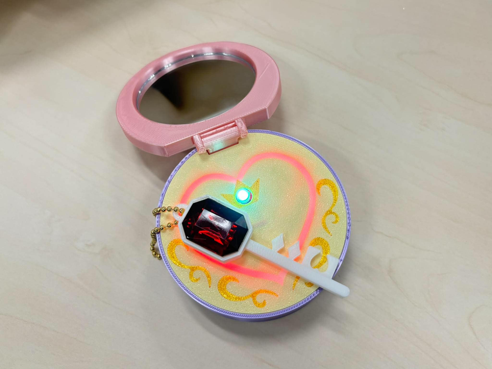
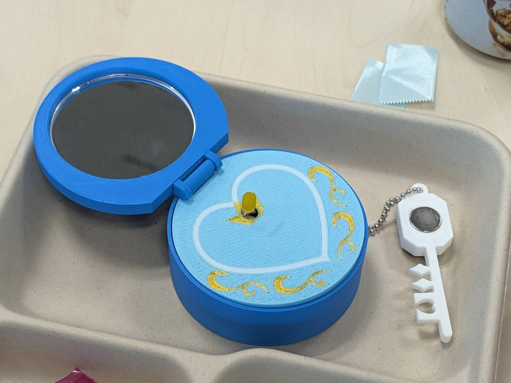
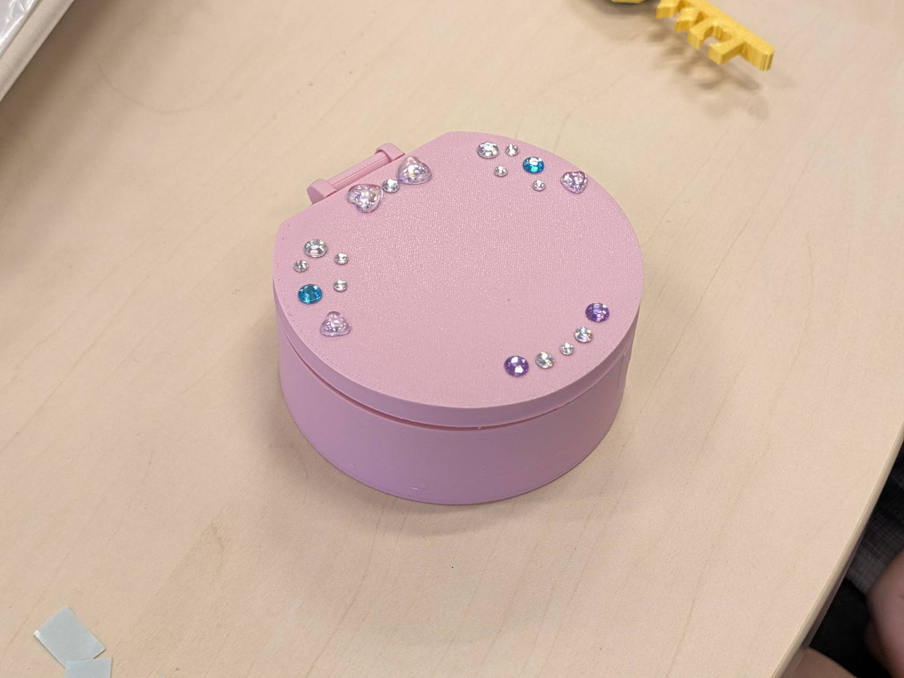
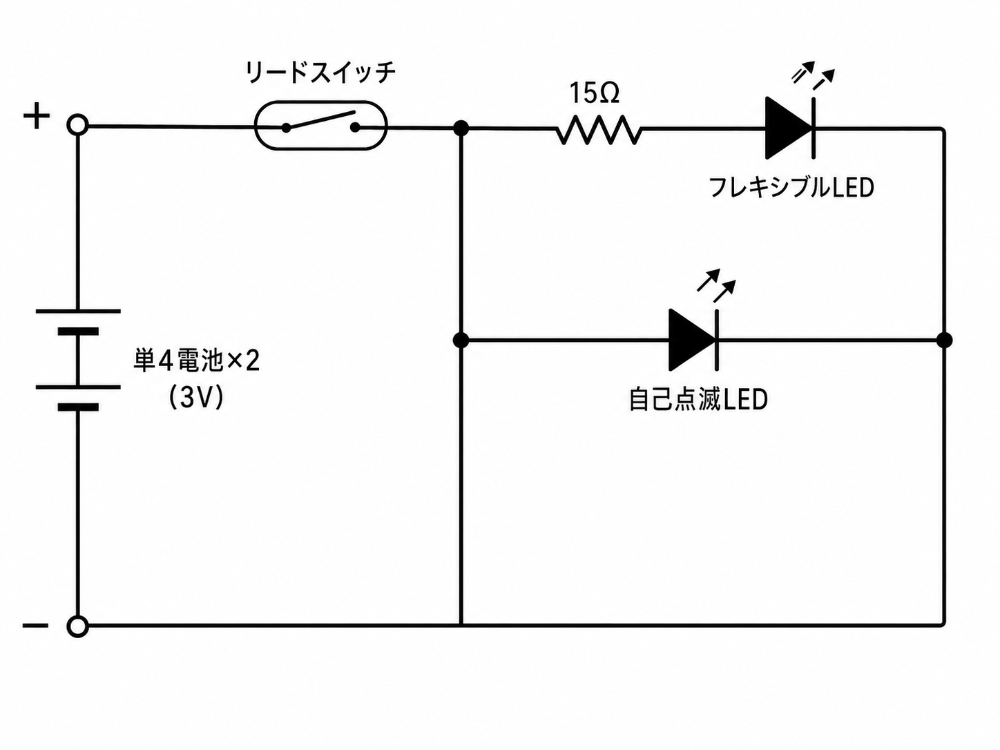

# 魔法のコンパクト（Magic Compact）

**磁石入りの鍵チャームを近づけると、内側が光るミラー付きコンパクト**の制作データです。外側はシールや石で自由にデコレーションできます。

| 内側（ミラー＋光るパーツ） | デコレーション例 |
|---|---|
|  |  |

磁石でリードスイッチがONになり、LEDに電気が流れて光るしくみ。中学生向け電子工作ワークショップのために設計したものですが、このリポジトリはおうちで1個から作れるようにまとめています。

- 所要時間：約45分（説明・組み立て込み。デコレーションは好きなだけ）
- 必要なスキル：かんたんなはんだ付け

## しくみ

磁石を近づける → リードスイッチがON → 電気が流れてLEDが光る。
磁石は「電気を作る」のではなく「スイッチをオンにする」役割です。

## 3Dプリントデータ（`stl/`）

すべてPLAでの印刷を想定しています。

| ファイル | パーツ | 備考 |
|---|---|---|
| `A_body_bottom.stl` | ボディ（ボトム） | 回路・光るパーツが入る側 |
| `B_body_lid_mirror.stl` | ボディ（蓋） | ミラーを両面テープで固定する側 |
| `C_hinge.stl` | ヒンジ | ボディ上下をつなぐ |
| `D_inner_5mmLED.stl` | 内側パーツ（穴7mm） | 5mm LED＋拡散カバー用 |
| `D_inner_3mmLED.stl` | 内側パーツ | 3mm LED用 |
| `key_charm.stl` | 鍵チャーム | ネオジム磁石を仕込むキーチェーン |

## 材料（1個分）

### 電子部品（秋月電子通商）

| 部品 | 数量 | 備考 |
|---|---:|---|
| [電池ボックス 単4×2本 リード線・フタ・スイッチ付［100348］](https://akizukidenshi.com/catalog/g/g100348/) | 1 | 130円 |
| [リードスイッチ MKA-10110［103676］](https://akizukidenshi.com/catalog/g/g103676/) | 1 | 5個セット290円 |
| [自己点滅LED 5mm 白 OSW5DS5B61A［115198］](https://akizukidenshi.com/catalog/g/g115198/) | 1 | 5個セット160円、3.3V品 |
| フレキシブルLED（好きな色をいずれか1本） | 1 | 各400円、3V品。[青](https://akizukidenshi.com/catalog/g/g118008/)・[黄](https://akizukidenshi.com/catalog/g/g118010/)・[赤](https://akizukidenshi.com/catalog/g/g118006/)・[緑](https://akizukidenshi.com/catalog/g/g118007/)・[ピンク](https://akizukidenshi.com/catalog/g/g118009/)・[白（ウォームホワイト）](https://akizukidenshi.com/catalog/g/g118011/) |
| [カーボン抵抗 1/4W 15Ω［114289］](https://akizukidenshi.com/catalog/g/g114289/) | 1 | 100個セット100円、フレキシブルLED用 |

### その他の材料

| 品名 | 数量 | 参考 |
|---|---:|---|
| ネオジム磁石（丸・直径13mm×厚み1mm） | 1 | [Amazon（10個入）](https://www.amazon.co.jp/dp/B0FHKL6JNX)。鍵チャームに仕込む |
| ミラー 丸 60mm（ガラス製） | 1 | [貴和製作所](https://kiwaseisakujo.jp/collections/g-metalfittings-goods-mirror/products/g-metalfittings-goods-mirror-002)、88円 |
| 単4電池 | 2 | — |
| PLAフィラメント | — | 3Dプリント用 |
| マスキングテープ | — | 部品の固定・絶縁用 |
| 両面テープ | — | ミラー固定用 |
| ボールチェーン | 1 | 鍵チャーム用 |
| デコレーション用のシール・石 | — | 好みで。石は手芸店や100円ショップのもので大丈夫です |

## 配線

自己点滅LEDとフレキシブルLEDの両方を光らせます。2つのLEDは**並列**につなぎ、その手前にリードスイッチを**直列**に入れます。フレキシブルLEDだけは15Ωの抵抗を直列に入れてください（自己点滅LEDはそのままでOK）。

はんだ付けの手順：

1. 電池ボックスの赤いリード線（＋）をリードスイッチの片方の足へ
2. リードスイッチのもう片方の足から、①自己点滅LEDの＋（足の長い方）と、②15Ω抵抗→フレキシブルLEDの＋ の2系統に分岐
3. 両LEDの−を電池ボックスの黒いリード線（−）へまとめる
4. 電池を入れ、電池ボックスのスイッチをONにして、磁石を近づけて点灯確認

> ⚠️ リードスイッチのガラス管は割れやすいので、足を曲げるときは根元をペンチで押さえて曲げ、ガラス部分に力をかけないこと。

## 組み立て手順

1. **回路を作る** — 上の「配線」のとおりにはんだ付けし、磁石を近づけて点灯確認
2. **光るパーツを固定する** — 内側パーツ（D）のミゾに回路を収め、マスキングテープで固定・絶縁。5mm LEDには拡散カバーを取り付けて、もう一度点灯確認
3. **本体を組み立てる** — 蓋（B）の内側にミラーを両面テープで固定し、ヒンジ（C）でボディ上下（A・B）をはめこむ
4. **鍵チャームを作る** — 鍵チャームにネオジム磁石を仕込み、ボールチェーンをつける
5. **光るか確認** — 鍵チャームをコンパクトに近づけて点灯確認
6. **かざりつける** — シールや石で自分だけのデザインに

## トラブルシューティング

点灯しないときは、次の順で確認してください。

1. **電池ボックスのスイッチがONになっているか**
2. 電池の向き（＋−）
3. 磁石の位置・距離（リードスイッチの真横に近づける）
4. 配線の挟み込み・接触（マスキングテープの絶縁がはがれていないか）
5. はんだ付けの外れ

## クレジット

- 設計相談：[ハヤカワ五味さん](https://x.com/GomiHgy)
- CADデータ作成：株式会社なかよし uni

### スポンサー（カンパ）

- iketomo様（歩宇宙株式会社 代表取締役）
- いぶし銀様（AIリスキリング中／女児の母）
- [kiyo様](https://m.youtube.com/@kiyo3d)
- [saldra様](https://x.com/sald_ra)（生成AIなんでも展示会主催）
- [白川みちる様](https://x.com/micchiebear)（TinyGo Keeb）
- [fumi様](https://x.com/_fumiT)

## ライセンス

[CC BY-NC 4.0](https://creativecommons.org/licenses/by-nc/4.0/deed.ja)（表示・非営利）

クレジットを表示すれば、非営利目的での利用・改変・再配布は自由です。営利目的での利用（キット化しての販売など）をご希望の場合はご相談ください。
